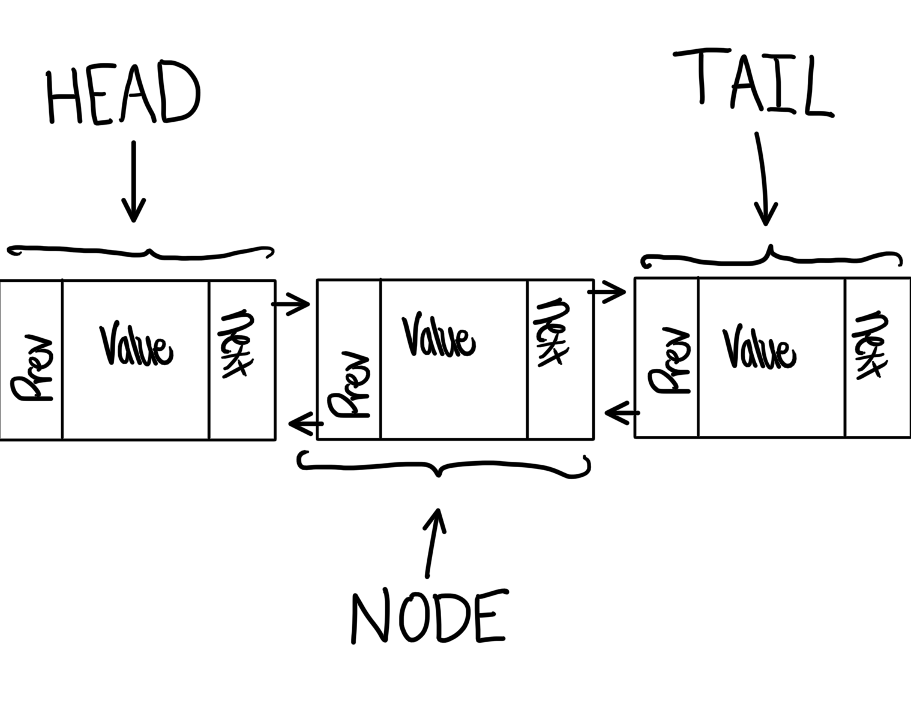

# Linked Lists

## Introduction
Linked Lists is an effective data structure of storing data. It allows the user to insert, delete, and find data effectively. Linked Lists is essentially a normal list with pointers. Each element of the list is called a node.The node includes the value of the element, as well as the previous and next node. The first node of the linked list is called the head, while the last is the tail.  



## Example of Linked Lists

### Structure of Linked Lists
Linked Lists are created as a class with a subclass of nodes. Here is an example of a linked list.
```
class LinkedList:
    class Node:

        def __init__(self, data):

            self.data = data
            self.next = None
            self.prev = None

    def __init__(self):

        self.head = None
        self.tail = None

    
```
### Inserting into Linked Lists
Inserting into linked lists requires making a function inside the Linked List class. The powerful thing about linked lists is the O(1) performance except when inserting or deleting from the middle.

When inserting into a linked list, one needs to assign reasign the previous node's next and the next nodes previous. If you trying to insert from the top, then you need to make the new node the head while if you are inserting at the end, the new node becomes the tail.

#### Insert Head Example
If you were to insert a new head with data already in it, it would look like this:
```
def insert_head(self, data):

    new_node = Node(data)

    new_node.next = self.head
    self.head.prev = new_node
    self.head = new_node


```

For the <strong>prove assignment</strong>, you will be inserting the tail. 

### Removing from Linked Lists
Removing from linked lists very simple compared to inserting. In order to remove from a linked list, all you do is reassign the next and prev of the surrounding nodes, and then the targeted node is automatically deleted.

#### Remove Head Example
If you were to remove the head with the data in it, it would look like this: 
```
def remove_head(self):
    self.head.next.prev = None
    self.head = self.head.next
```

## Performance

## Linked_Lists Prove

## Conclusion


#### [Return Home](README.md)